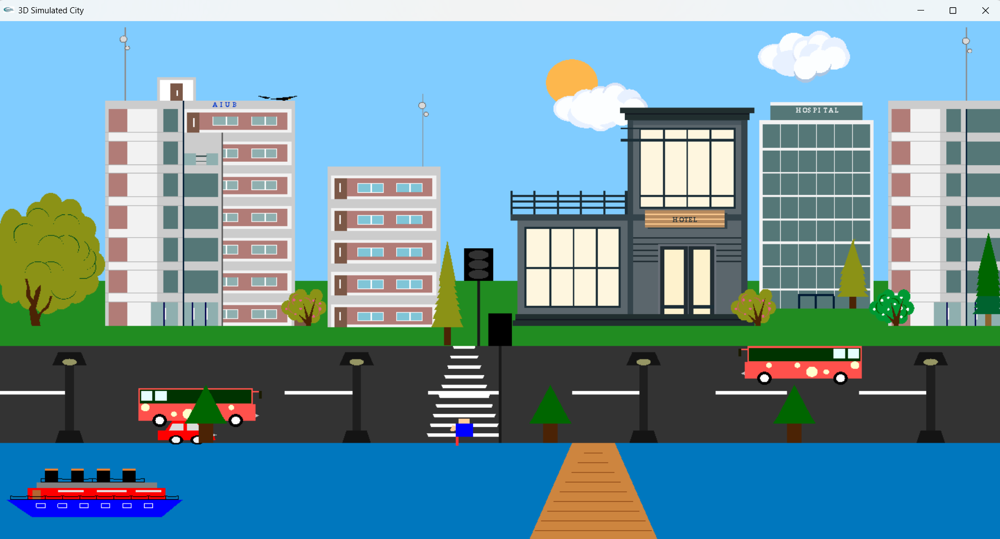
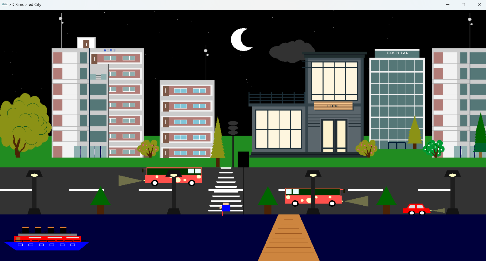

# 🌆 3D City Simulation – OpenGL Computer Graphics Project

A **3D city simulation** developed using **OpenGL and C++** as part of an academic **Computer Graphics course**.  
The project demonstrates real-time rendering, animation, traffic logic, environmental effects, and interactive keyboard controls within a simulated urban environment.

---

## ✨ Features

### 🌇 Environment & Time Simulation
- Day and night mode switching
- Dynamic weather effects:
  - Rainfall
  - Snowfall
- Sky, lighting, and atmosphere changes based on environment state

---

### 🚦 Traffic Light System
- Fully functional traffic lights:
  - 🔴 **Red** – Vehicles stop, pedestrian crossing enabled
  - 🟡 **Yellow** – Transition phase
  - 🟢 **Green** – Vehicles move
- Vehicles respond dynamically to traffic signals
- Pedestrian movement synchronized with traffic lights

---

### 🚗 Vehicles & Pedestrians
- Multiple animated vehicles on the road
- Adjustable vehicle speed via keyboard input
- Pedestrian crossing animation
- Vehicle headlights visible during night mode

---

### 🏙 City Elements
- Buildings (residential, hospital, hotel, institutional)
- Roads, footpaths, street lights, trees
- Water body with ship animation
- Realistic city layout design

---

## ⌨ Controls & Key Bindings

The simulation is fully interactive and can be controlled using the keyboard.

### 🚗 Vehicle Controls
| Key | Action |
|----|--------|
| **W / Q** | Increase vehicle speed |
| **S** | Decrease vehicle speed |

---

### 🌦 Environment Controls
| Key | Action |
|----|--------|
| **B** | Start rainfall |
| **P** | Start snowfall |
| **D** | Switch to day mode |
| **N** | Switch to night mode |

---

### 🚦 Traffic Light Controls
| Key | Action |
|----|--------|
| **G** | Green light (vehicles move) |
| **Y** | Yellow light (transition state) |
| **R** | Red light (vehicles stop, pedestrian crossing enabled) |

---

## 🖼 Screenshots

### 🌆 Environment & Weather

---

### 🚦 Traffic Control

---

## 🛠 Technologies Used
- **C++**
- **OpenGL**
- **GLUT / FreeGLUT**
- Core Computer Graphics concepts:
  - Transformations
  - Animation
  - State-based logic
  - Event-driven interaction

---

## ▶ How to Run
1. Clone the repository
2. Open the project in a C++ IDE  
   *(Visual Studio / Code::Blocks / any OpenGL-supported IDE)*
3. Ensure OpenGL and GLUT are properly configured
4. Build and run the project

---

## ℹ Notes
- This is a simulation-based academic project
- Focused on graphics rendering and interactive logic
- No real-world physics or AI systems are implemented

---

## 👤 Author
**Sajidur Rahman Sajid**  
BSc in Computer Science & Engineering (CSE)
Final-year undergraduate student
